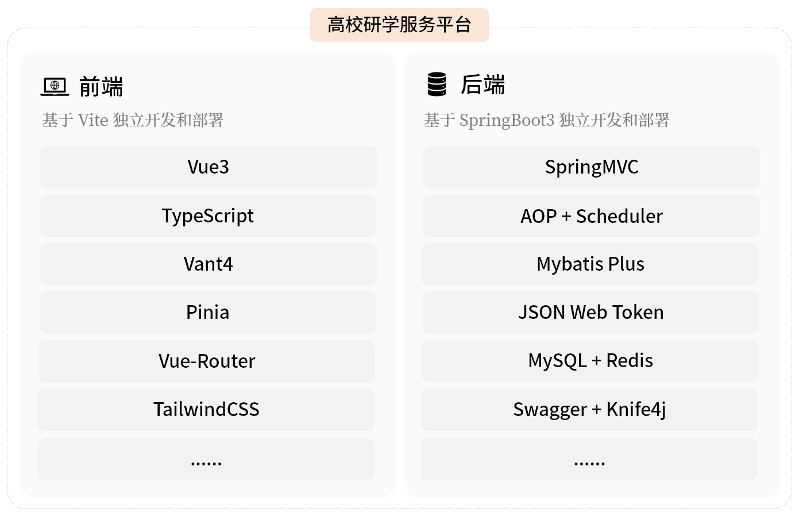
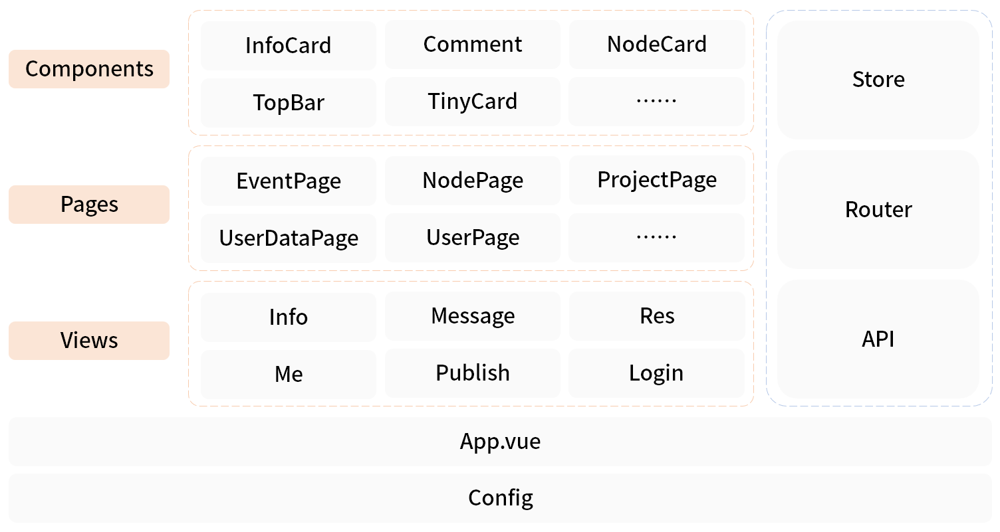
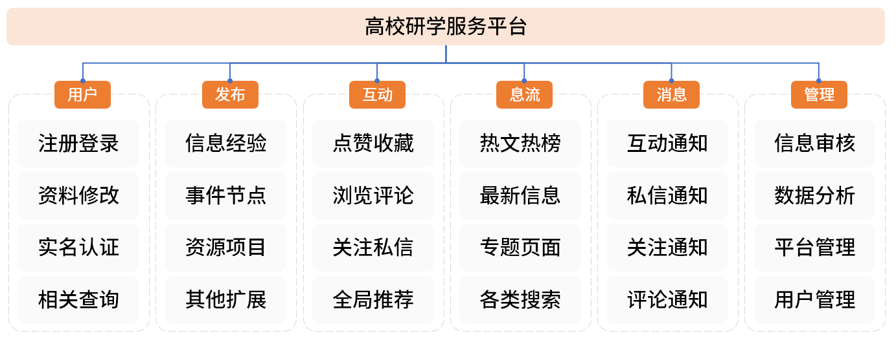
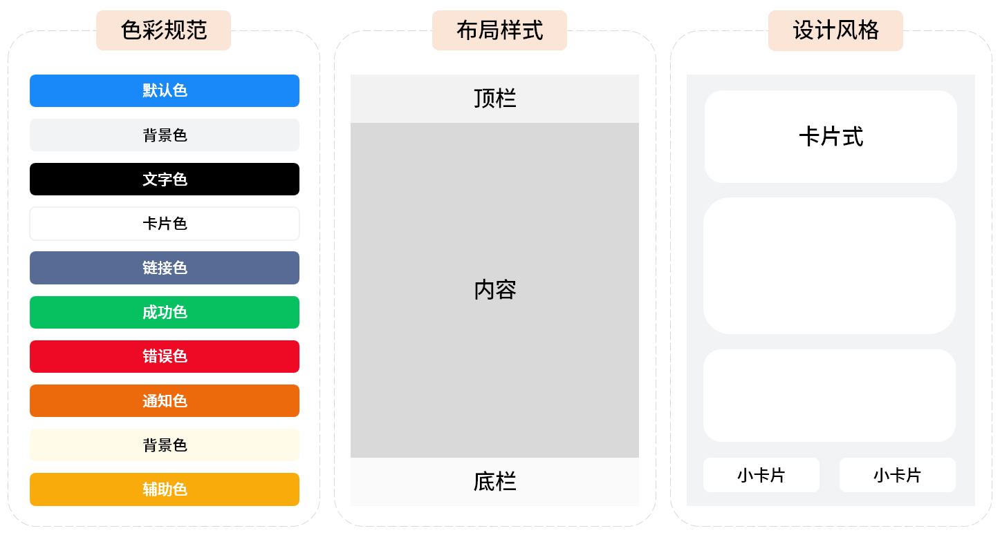
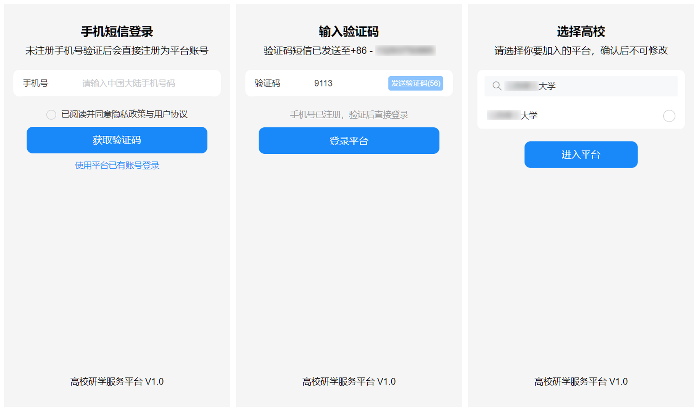
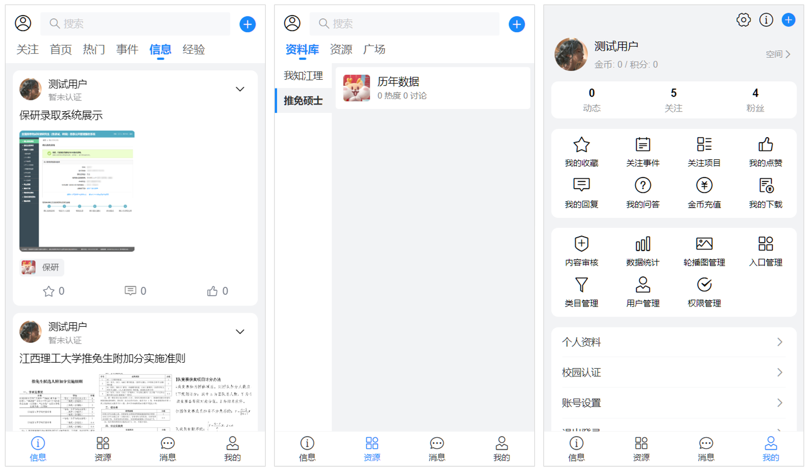
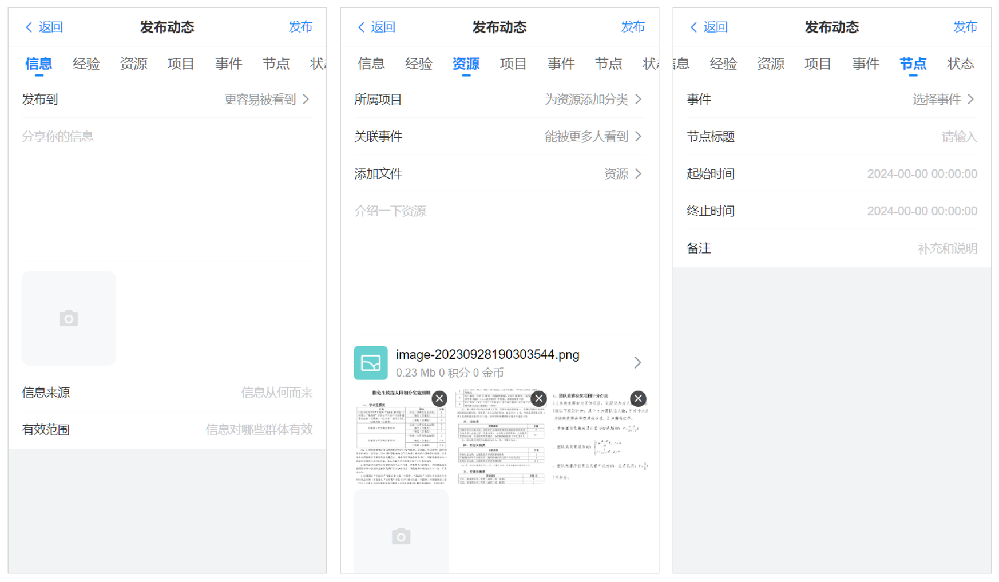
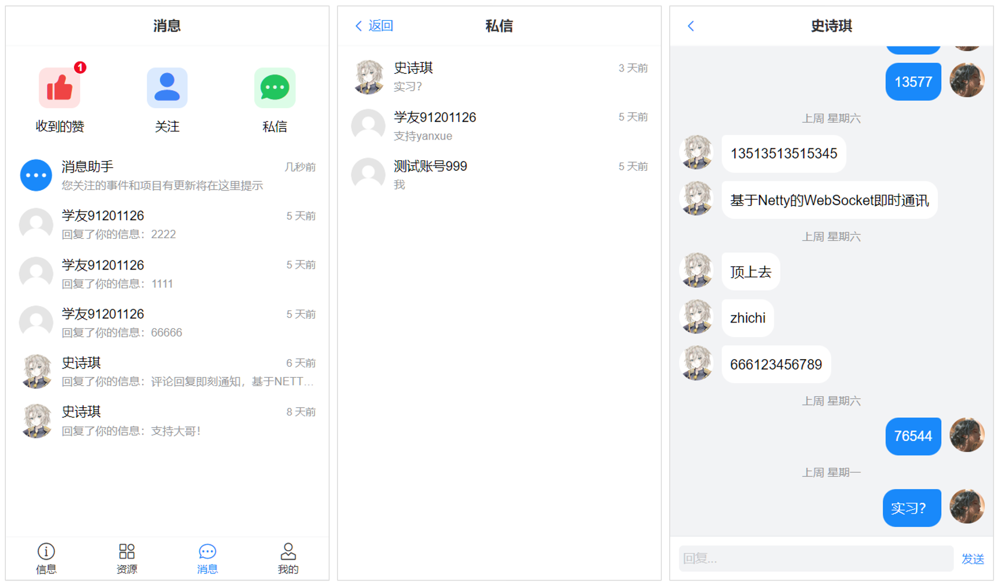
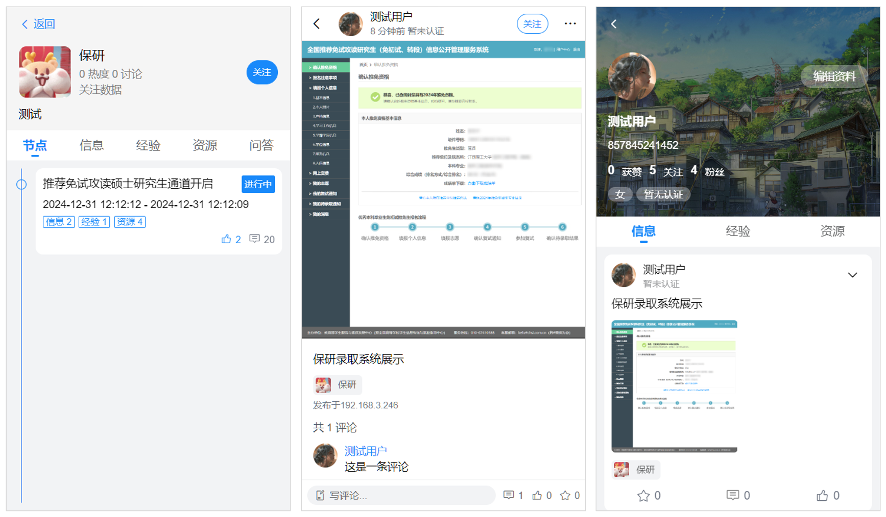

<p align="center">
  
</p>

<h1 align="center">Evolve</h1>

<p align="center">
  <strong>高校学习生活社区平台 / 前端</strong>
</p>

<p align="center">
  
  
  
  
  
  
</p>

<p align="center">
  打破信息茧房 • 促进资源平等 • 提倡互助分享 • 提高综合能力
</p>

---

## 📖 目录

- [项目简介](#-项目简介)
- [功能特性](#-功能特性)
- [技术栈](#-技术栈)
- [快速开始](#-快速开始)
- [项目结构](#-项目结构)
- [架构设计](#-架构设计)
- [界面预览](#-界面预览)
- [许可证](#-许可证)

---

## 🎯 项目简介

**Evolve** 是一个面向高校学生的学习生活社区平台，致力于解决大学生在信息获取和资源共享方面遇到的痛点问题。

### 背景

我国目前共计开设有三千多所高等院校，许多大学生在从高中生的操办式被动学习到大学生的放养式主动学习的身份转变中曾感到未知、乏力与后知后觉。进入大学后，学生将面临适应全新的生活环境、基于学分制的学习模式、评优评先以及选择未来就业、考研、保研等道路的多重考验。

目前，大学生获取校内信息的主要方式为利用即时聊天的群聊功能并基于班委责任制转发通知，常出现迟发、漏发、不发等现象。学习资源散落分布不均，查找难度大，质量参差不齐，学生之间交流渠道有限，资源互通效率比较低下。

### 核心价值

| 价值主张 | 说明 |
|---------|------|
| 🔓 **打破信息茧房** | 提供本校学生获取信息最快、最准确的途径，并提供较为全面的信息视角解读 |
| ⚖️ **促进资源平等** | 建立高校资源库，从产出和整理两条路线提高资源质量，丰富资源数量 |
| 🤝 **提倡互助分享** | 基于互助和分享策略提供信息和资源服务，让大学生意识到信息资源流通的重要性 |
| 📈 **提高综合能力** | 支撑大学生完成学业的同时，促进个人能力提高 |

---

## ✨ 功能特性

- 📰 **信息流通** - 校内通知、活动、竞赛等信息的发布与订阅
- 📚 **资源共享** - 课程资料、复习提纲、学习资源的上传与下载
- 💬 **社区互动** - 点赞、评论、转发和收藏等社交功能
- 🎓 **经验分享** - 高年级学生分享学习经验和择业指导
- 🔔 **消息通知** - 关注事件的实时推送提醒
- 📊 **热门榜单** - 展示校内学生普遍关注的事情、信息或经验

---

## 🛠️ 技术栈

### 核心框架

| 技术 | 版本 | 说明 |
|-----|------|------|
| [Vue 3](https://vuejs.org/) | 3.4.x | 渐进式 JavaScript 框架 |
| [TypeScript](https://www.typescriptlang.org/) | 5.3.x | JavaScript 的超集，提供类型安全 |
| [Vite](https://vitejs.dev/) | 5.0.x | 下一代前端构建工具 |

### UI 与样式

| 技术 | 版本 | 说明 |
|-----|------|------|
| [Vant](https://vant-ui.github.io/vant/) | 4.8.x | 轻量、可靠的移动端组件库 |
| [TailwindCSS](https://tailwindcss.com/) | 3.4.x | 原子化 CSS 框架 |
| [Sass](https://sass-lang.com/) | 1.71.x | CSS 预处理器 |

### 状态管理与路由

| 技术 | 版本 | 说明 |
|-----|------|------|
| [Pinia](https://pinia.vuejs.org/) | 2.1.x | Vue 官方状态管理库 |
| [Vue Router](https://router.vuejs.org/) | 4.2.x | Vue 官方路由管理器 |
| [pinia-plugin-persistedstate](https://prazdevs.github.io/pinia-plugin-persistedstate/) | 3.2.x | Pinia 持久化插件 |

### 工具库

| 技术 | 版本 | 说明 |
|-----|------|------|
| [Axios](https://axios-http.com/) | 1.6.x | HTTP 请求库 |
| [Day.js](https://day.js.org/) | 1.11.x | 日期处理库 |
| [Lodash](https://lodash.com/) | 4.17.x | 实用工具库 |

---

## 🚀 快速开始

### 环境要求

- **Node.js** >= 18.0.0
- **npm** >= 9.0.0 或 **pnpm** >= 8.0.0

### 安装依赖

```bash
# 克隆项目
git clone https://github.com/Sealt/Evolve.git
cd evolve

# 安装依赖
npm install
```

### 开发运行

```bash
# 启动开发服务器
npm run dev
```

### 构建部署

```bash
# 类型检查
npm run type-check

# 构建生产版本
npm run build

# 预览构建结果
npm run preview
```

### 环境变量

在项目根目录创建 `.env.development` 或 `.env.production` 文件配置环境变量：

```env
wsVITE_REQUEST_TIMEOUT = 5000
VITE_BASE_URL = http://your-api-url/evolve/api
VITE_ICON_URL = http://your-api-url/evolve
VITE_URL = http://your-api-url
VITE_WS_URL = ws://your-api-url/ws
```

---

## 📁 项目结构

```
evolve/
├── assets/                  # 静态资源 (README 图片等)
├── public/                  # 公共静态资源
├── src/
│   ├── api/                 # API 请求接口封装
│   ├── assets/              # 项目资源文件
│   ├── axios/               # Axios 实例配置
│   ├── components/          # 公共组件
│   │   ├── NoticeItem/      # 通知条目
│   │   ├── InfoCard/        # 信息卡片
│   │   ├── TopBar/          # 顶部工具栏
│   │   └── ...
│   ├── pages/               # 子页面
│   │   ├── user/            # 用户相关页面
│   │   ├── publish/         # 发布相关页面
│   │   └── ...
│   ├── router/              # 路由配置
│   ├── stores/              # Pinia 状态管理
│   ├── styles/              # 全局样式
│   ├── views/               # 主视图
│   │   ├── Login/           # 登录注册
│   │   ├── Home/            # 首页
│   │   ├── Info/            # 信息
│   │   ├── Resource/        # 资源
│   │   ├── Message/         # 消息
│   │   └── Profile/         # 我的
│   ├── App.vue              # 根组件
│   ├── main.ts              # 入口文件
│   └── style.css            # 全局样式入口
├── .env.development         # 开发环境变量
├── .env.production          # 生产环境变量
├── index.html               # HTML 模板
├── package.json             # 项目配置
├── tailwind.config.js       # TailwindCSS 配置
├── tsconfig.json            # TypeScript 配置
└── vite.config.ts           # Vite 配置
```

---

## 🏗️ 架构设计

### 总体架构

本项目采用前后端分离架构，前端负责界面展示和用户交互，通过 RESTful API 与后端服务通信。

<p align="center">
  
</p>

### 前端架构

平台前端基于 Vite 构建，提供极速的服务启动与热重载功能。框架采用搭配 TypeScript 的渐进式 JS 框架 Vue 3，项目使用 Vant 4 组件库作为基础，引入 Pinia、Vue Router、TailwindCSS 等为项目提供全局数据管理、路由控制、CSS 原子化等功能。

<p align="center">
  
</p>

### 模块说明

| 模块 | 目录 | 说明 |
|-----|------|------|
| **App** | `App.vue` | Vue 项目的起始页面，放置路由切换组件 |
| **Views** | `views/` | 主要界面组件，包含登录、发布、信息、资源、消息、我的等入口级视图 |
| **Pages** | `pages/` | 由主视图跳转访问的子页面 |
| **Components** | `components/` | 复用率较高的界面组件 |
| **Stores** | `stores/` | Pinia 状态管理，存储全局共享数据 |
| **Router** | `router/` | Vue Router 路由配置 |
| **API** | `api/` | 后端接口请求方法集合 |

---

## 📱 界面预览

### 总体模块设计
<p align="center">
  
</p>

### 交互界面设计
<p align="center">
  
</p>

### 用户页面设计
<p align="center">
  
</p>

### 主要页面设计
<p align="center">
  
</p>

### 发布页面设计
<p align="center">
  
</p>

### 消息页面设计
<p align="center">
  
</p>

### 详细页面设计
<p align="center">
  
</p>

---

## 📄 许可证

本项目采用 [MIT License](LICENSE) 开源许可证。

---

<p align="center">
  <sub>Made with ❤️ for university students, Welcome to Star!</sub>
</p>